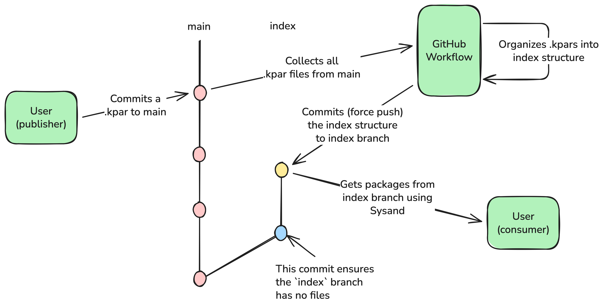

# Internal Sysand Project Index Example -- GitHub edition

An example GitHub repository and GitHub workflow that could be used to self-host
an internal (private) SysML v2 Project Index for use with
[Sysand](https://github.com/sensmetry/sysand).

This example is not intended to be the one and only approach for self-hosting a
project index, but rather a way to quickly spin up an initial index. The
included GitHub workflow is also very minimal and the end-users should customise
it for their needs (e.g. adding quality gates).

> [!NOTE]
> Since GitHub Pages do not allow authorization using Personal Access
> Tokens, this example is a workaround that uses
> `raw.githubusercontent.com` to expose the files to Sysand CLI.
> Sensmetry cannot guarantee that accessing files through
> `raw.githubusercontent.com` will not be rate-limited by GitHub, thus if you
> expect a large volume of requests going to this index, this solution might
> not be ideal.

The URL of the index will look something like this:
`https://raw.githubusercontent.com/OWNER/REPO/refs/heads/index/`

## Deployment workflow

1. Commit to `main` with `.kpar` file added to the `packages/<project>/` folder.
   - The internal package registry uses the `urn:kpar:` + the `name` field from
     `.project.json` for the IRI.
   - Thus, to make referencing the package easier, the `name` **shall** be
     ASCII-only, with no spaces (`-` strongly encouraged to be used in place of
     the space), lowercase-only, and no longer than 32 characters. Other rules
     can be set up internally, but then the CI workflow needs to be adjusted to
     account for that (e.g. if allowing spaces in the name).
   - The `<project>` folder **should** be called the same as the `name` for
     easier file discovery in the repo itself, but otherwise there is no strict
     rule.
   - The name of the `.kpar` file does not matter, but it is strongly suggested
     for it to have a version number inside it, so that if there are multiple
     versions of the same project, the `.kpar`s do not overwrite each other
     accidentally.
2. When commit lands on `main`, a new workflow starts that:
    1. Uses Sysand to create an environment ([`sysand
       env`](https://docs.sysand.org/commands/env.html))
    2. Uses Sysand to install all `.kpar`s from `packages/**` folder ([`sysand
       env install --path /path/to/kpar --no-deps --allow-multiple <IRI as
       described in step
       1.>`](https://docs.sysand.org/commands/env/install.html))
    3. Copies all contents of `sysand_env` folder to `index` folder and saves
       the index folder as an artifact
    4. Checks out the `index` branch, `git reset --hard`s to a commit that made
       the `index` branch have no files.
    5. Extracts the `index` contents from the build artifact.
    6. `git add`s all the contents, commits the changes with `Publish Index`
       commit, and **force** pushes \* to `index` branch.

_\* NOTE:_ Force pushing is used to avoid making the git repo size from
exploding with each commit. Additionally, the `index` branch should not be used
by humans, and it only contains the automatically generated artifacts. Ideally,
the branch should be protected and only the bot account should be able to push
to it.

## Using workflow

1. Create a [GitHub Personal Access
   Token](https://github.com/settings/personal-access-tokens) (we recommend
   using fine-grained tokens) scoped to the index repository and the `Contents`
   read-only permissions.
2. Create a `.env` file or use other means to set the following environment
   variables. For `<X>` you can use whatever you want.
    - `SYSAND_CRED_<X>` with the value
      `https://raw.githubusercontent.com/OWNER/REPO/refs/heads/index/**` (the
      `refs/heads/index/**` part is important!)
    - `SYSAND_CRED_<X>_BEARER_TOKEN` with the value set to the Personal Access
      Token generated in step 1.
    - For more information about how Sysand deals with Authentication, refer to
      [Sysand documentation](https://docs.sysand.org/authentication.html).
    - An example `.env.example` file is provided in this repo.
3. Use the `--index` Sysand CLI argument with the value of
   `https://raw.githubusercontent.com/OWNER/REPO/refs/heads/index/` when
   installing the packages from this index OR use `sysand.toml` config file with
   the index set there.
    - For more information about how to set up Sysand to use custom indices,
      refer to [Sysand
      documentation](https://docs.sysand.org/config/indexes.html).
    - An example `sysand.toml` config file is provided in this repo.

## First time setup

You need to set up a GitHub repo as follows:

- Commit anything to the `main` branch.
- Push the `main` branch to GitHub.
- Create an `index` branch from the initial commit.
- Delete **all** files from the repo, and commit the deletion to the `index`
  branch (blue circle in the above diagram).
- Note down the SHA of the deletion commit.
- Push the `index` branch to GitHub.
- Check out `main` branch again.
- Enter that SHA into the [`.github/workflows/ci.yml`](.github/workflows/ci.yml)
  file, line 54 (the one with `git reset --hard`).
- Commit and push the SHA change.
- You should be good to go! Whenever you add a `.kpar` file to the `packages`
  folder, the CI should trigger and the package should become available through
  [`sysand add`](https://docs.sysand.org/commands/add.html) or `sysand clone`.

Don't forget to update the `OWNER/REPO` parts of the `raw.githubusercontent.com`
URLs in this `README.md`, [`.env.example`](.env.example), and
[`sysand.toml`](sysand.toml) files, to make it easier for your colleagues to
access the index URL.
